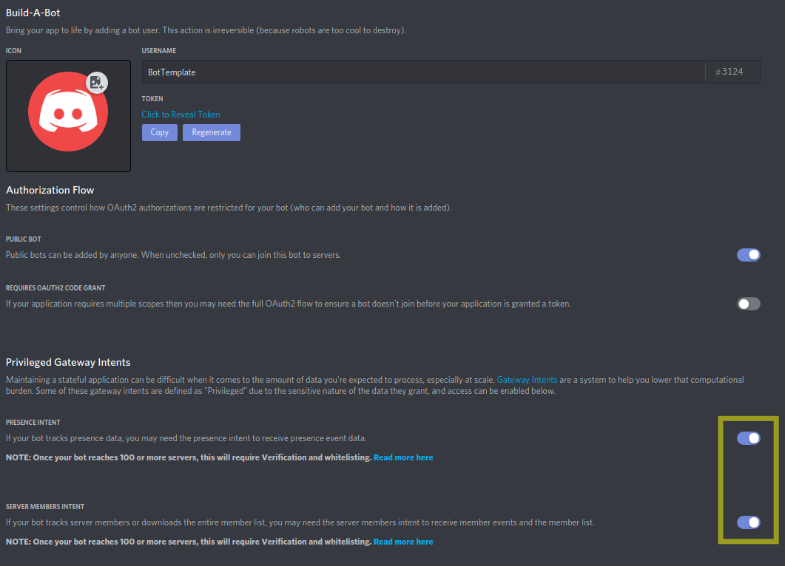
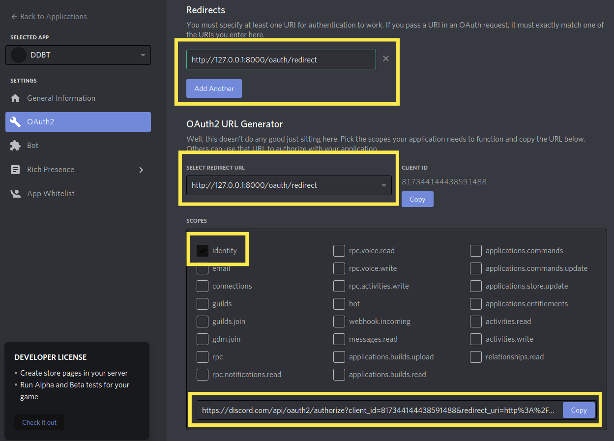

## Development Setup
1. Create the sqlite3 database and load the fixture (default settings for the discord bot):
    ```
    python3 app/manage.py migrate
    python3 app/manage.py createsuperuser --username=user --email=
    python3 app/manage.py loaddata settings.yaml
    ```
2. Open the [Discord Developer Portal](https://discord.com/developers)
3. Create a 'New Application':  
   
4. Now open the Bot settings:  
   
5. Copy your bot token and export it as `DISCORD_BOT_TOKEN` environment variable:  
   
6. Don't forget to enable `Privileged Gateway Intents` (right below the `Authorization Flows` in the bot settings):  
   
7. Add the bot to your discord server
   
8. Copy client id (environment variable `OAUTH_CLIENT_ID`) and client secret (environment variable `OAUTH_CLIENT_SECRET`)  
   
9. Create a OAuth2 redirect (if you would like to deploy the bot, you need to change 127.0.0.1:8000 to the public url).
   Export the generated url (don't forget to enable identify scope) as environment variable `OAUTH_URL`.  
   
10. Start the application:
    ```
    gunicorn app.asgi:application -k uvicorn.workers.UvicornWorker --bind 0.0.0.0:8000 --log-level DEBUG
    ```